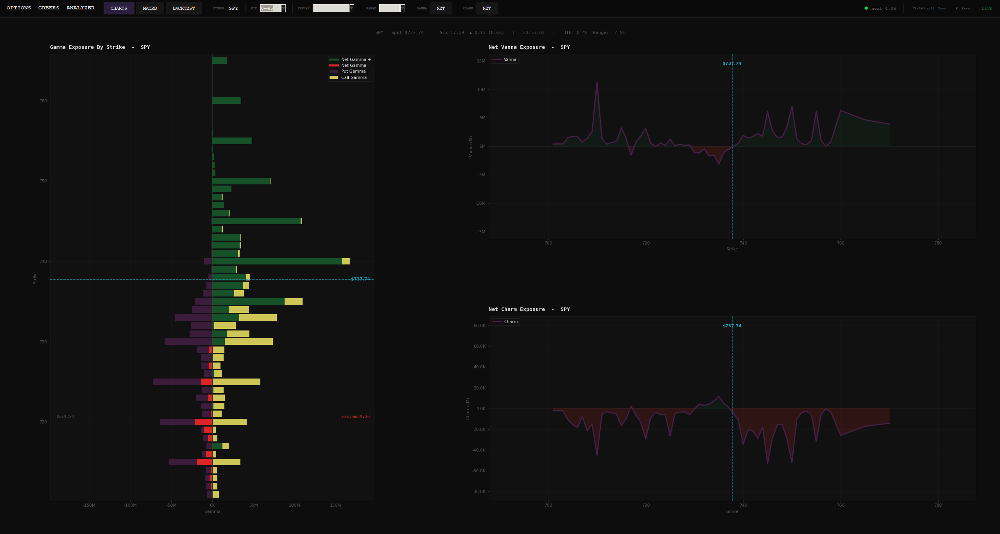

# Black-Scholes Greeks Dashboard

A Python tool that uses Schwab API data to fetch live options chain data
and compute second-order greeks for SPY, QQQ, and DIA. It visualizes current
GammaEX, VannaEX, and CharmEX for market maker hedging flows.



---

## What It Does

- Auth.py walks you through Charles Schwab's authentication process
- Fetches full options chain across near spot strikes and expirations for SPY, QQQ, DIA
- Computes first and second-order Greeks using Black-Scholes:
    - Delta, Vega (first-order)
    - Gamma, Vanna, Charm (second-order)
- Measures both call and put greeks with a net toggle option
- Aggregates net dealer exposure by strike across all expirations, scaled by
    open interest and the options multiplier
- Renders a multi-panel dashboard showing GammaEX, VannaEX, and CharmEX
    for three ETFs

| Greek | Order | What It Tells You |
|-------|-------|-------------------|
| **Gamma (GEX)** | 2nd | How dealer delta changes per $1 move — positive GEX stabilizes price, negative GEX amplifies moves |
| **Vanna (VannEX)** | 2nd | How dealer delta changes when IV moves — drives mechanical flows after VIX spikes/drops |
| **Charm (CharmEX)** | 2nd | How dealer delta changes as time passes — creates predictable intraday drift even with no price move |

### Why This Matters for Markets

When dealers are in a negative gamma regime (GEX < 0), they're hedging
with the market. This causes dealers to amplify the current trend. GEX exposes
the strikes that dealers are positioned the heaviest. These levels can act as
strong support or resistance.

Vanna Exposure charts the sensitivity of dealer delta hedges to changes in implied
volatility. When IV moves dealers are forced to buy or sell the underlying to hedge.
The direction and magnitude of those flows can be found in the vanna profile before
the move ever happens.

Charm represents delta decay. As dealers' delta decays from options they have sold,
they must buy or sell shares to rebalance their hedge. Charm gives us an idea of those
guaranteed flows as expirations get closer.

---

## Usage

### Demo Mode
No credentials required. Run the script with no `.env` file and it launches automatically
in demo mode using a synthetic SPY dataset modelled on real market structure:

```bash
python gex-dashboard.py
```

The demo runs the full Greeks engine on simulated options chain data — same Black-Scholes
calculations as live mode, with realistic OI distribution, volatility skew, and key levels.
The BACKTEST module requires live mode and will display a message if accessed in demo.

### Live Mode
Add your Schwab API credentials to a `.env` file in the project root:

```
SCHWAB_CLIENT_ID=your_client_id
SCHWAB_CLIENT_SECRET=your_client_secret
```

Run `auth.py` first to complete Schwab's OAuth flow and cache your access token, then:

```bash
python gex-dashboard.py
```

Live mode fetches real-time options chains for SPY, QQQ, and DIA, auto-refreshing
every 5 minutes. A status indicator in the control bar shows refresh state.

---

## Modules

### GEX / VannEX / CharmEX (Charts)
The main module. Displays a horizontal bar chart of Gamma Exposure by strike alongside
Vanna and Charm exposure curves. Key levels such as spot price, gamma flip, and max pain
are overlaid on the GEX chart. Use the control bar to filter by DTE, expiration date,
and strike range, or toggle Vanna and Charm between net and call/put split views.

### Vol Smile
Plots implied volatility across strikes for both calls and puts, with spot price marked.
The shape of this curve reveals where the market is pricing risk. A classic volatility
skew is asymmetric; OTM puts carry higher IV than equidistant OTM calls, driven by
demand for downside protection. A volatility smile is symmetric, with IV being lowest ATM,
indicating the market is pricing the possibility of a large move in
either direction. This connects directly to the VannEX chart. A steeper skew means higher
vanna sensitivity and stronger mechanical hedging flows when IV moves.

### Backtest
Using the calendar widget, you can select any historical date to visualize that day's
opening GEX snapshot alongside its full open-to-close price action. This allows you to
study how price moved relative to key GEX levels — call walls, put walls, the gamma flip,
and max pain — and build intuition for how dealer positioning influences intraday structure.

> **Note:** This repo contains only the dashboard framework. Historical Greeks data is
> required to populate the backtest. See
> [schwab-greeks-historical-data](https://github.com/rreidriddle/schwab-greeks-historical-data)
> for the data collection and storage pipeline.

---

## Project Structure

```
black-scholes-greeks-dashboard/
├── gex-dashboard.py             # Main script — Greeks engine + API + dashboard
├── requirements.txt             # Python dependencies
├── .env                         # API credentials (not tracked by Git)
├── .gitignore                   # Protects credentials and cache files
├── README.md                    # This file
└── auth.py                      # Authenticator for Schwab API
```

## Installation

**Prerequisites**
- Python 3.12+
- Charles Schwab API credentials (see[developer.schwab.com](https://developer.schwab.com))

**Clone the repo and install dependencies**
```bash
git clone https://github.com/rreidriddle/black-scholes-greeks-dashboard.git
cd black-scholes-greeks-dashboard
pip install -r requirements.txt
```

**Set up credentials**

Create a `.env` file in the project root:
```
SCHWAB_CLIENT_ID=your_client_id
SCHWAB_CLIENT_SECRET=your_client_secret
```

**Authenticate**

Run `auth.py` once to complete Schwab's OAuth flow and cache your access token:
```bash
python auth.py
```
You will be prompted to log in via browser. Once complete, your token is cached locally
and the dashboard will auto-refresh it as needed.

**Run**
```bash
python gex-dashboard.py
```

## Sample Output — Console Summary

```
══════════════════════════════════════════════════════════
  SPY  |  Spot $679.66  |  OI 4,245,570
══════════════════════════════════════════════════════════
  Net GEX     $+0.531B  POSITIVE
  Net VannEX  $+253270K
  Net CharmEX -2.4584M

══════════════════════════════════════════════════════════
  QQQ  |  Spot $611.50  |  OI 2,649,282
══════════════════════════════════════════════════════════
  Net GEX     $+0.429B  POSITIVE
  Net VannEX  $+115152K
  Net CharmEX -1.3930M

══════════════════════════════════════════════════════════
  DIA  |  Spot $479.40  |  OI 85,254
══════════════════════════════════════════════════════════
  Net GEX     $+0.022B  POSITIVE
  Net VannEX  $+3950K
  Net CharmEX -0.0327M

```

## Author

**Reid Riddle**

- GitHub: [@rreidriddle](https://github.com/rreidriddle)
- LinkedIn: [linkedin.com/in/rreidriddle](https://www.linkedin.com/in/rreidriddle/)
