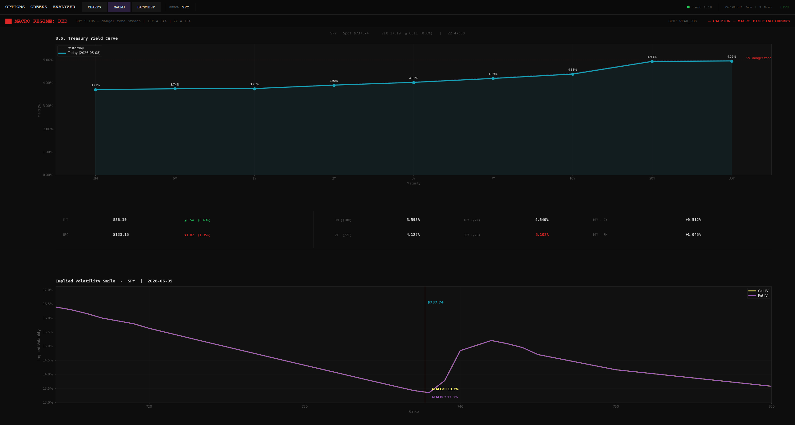

# Black-Scholes Greeks Dashboard

A live options analytics dashboard for SPY, built on the Schwab API. Computes and visualizes second-order Greeks (GEX, VannEX, CharmEX), a live Treasury yield curve with bond futures yields, macro regime classification, and an implied volatility smile. Includes a historical backtest module for replaying any past session against that day's opening GEX snapshot.


---

## What It Does

- Authenticates with the Charles Schwab API and fetches the full SPY options chain
- Computes Black-Scholes second-order Greeks across all near-the-money strikes and expirations
- Scales each Greek by open interest and the 100-share multiplier to produce dealer exposure estimates
- Derives key structural levels: gamma flip, call wall, put wall, max pain, ATM IV, GEX regime
- Fetches live macro data: Treasury yield curve (Treasury.gov), bond futures yields (/ZT /ZN /ZB), TLT, VIX
- Classifies a combined macro + GEX regime signal on every 5-minute refresh cycle
- Auto-refreshes all data every 5 minutes; startup pre-fetches everything so no tab is blank on launch

| Greek | What It Tells You |
|-------|-------------------|
| **GEX** (Gamma) | How dealer delta changes per $1 move in spot — positive GEX pins price, negative GEX amplifies moves |
| **VannEX** (Vanna) | How dealer delta changes when IV moves — drives mechanical buy/sell flows after VIX spikes or collapses |
| **CharmEX** (Charm) | How dealer delta decays with time — creates predictable intraday drift even without a price move |

---

## Tabs

### CHARTS

Three horizontal bar/curve panels side by side:

- **GEX** — Gamma Exposure by strike. Call GEX (stabilizing) and put GEX (destabilizing) shown as stacked bars, with net GEX as an overlay line. Gamma flip, call wall, put wall, and max pain overlaid as vertical reference lines. Spot price annotated.
- **VannEX** — Vanna Exposure by strike. Toggle between net view and call/put split.
- **CharmEX** — Charm Exposure by strike. Toggle between net view and call/put split.

Control bar filters: **DTE** (0DTE / 0-7 / 0-21 / 0-45), **Expiry** (specific date or ALL), **Range** (+/-3% / +/-5% / +/-8% from spot).

### MACRO



**Regime Badge** — synthesizes bond market and options positioning into a single label.

| Signal | What It Means |
|--------|---------------|
| STRONG BULLISH | Positive GEX + stable macro — dealers amplify upside |
| WEAK BULLISH | Mild tailwind — some confirmation needed |
| NEUTRAL | Conflicting signals — reduce size, wait |
| WEAK BEARISH | Mild macro headwind — yields rising or bonds weakening |
| STRONG BEARISH | Negative GEX + macro stress — dealers amplify downside |

**Yield Curve** — U.S. Treasury curve plotted for today (solid) and yesterday (ghost line), making daily shifts immediately visible. Key spreads annotated:
- **10Y-2Y** — primary recession indicator; turns red when inverted
- **10Y-3M** — complementary signal; often leads the 10Y-2Y

A red dashed line marks the 5% threshold on the 30Y yield — above it, Treasuries compete directly with equities for capital.

**Data Table** — compact grid showing:
- Treasury curve maturities: current yield + day-over-day change (green = fell, red = rose)
- Live bond futures: 3M ($IRX), 2Y (/ZT), 10Y (/ZN), 30Y (/ZB)
- Computed spreads: 10Y-2Y and 10Y-3M with inversion warnings
- TLT price and VIX with daily changes

**IV Smile** — implied volatility smile for the front-month expiry (closest to 30 DTE, industry standard). Call IV and put IV plotted across strikes. ATM IV annotated. The shape of the skew directly connects to VannEX: a steeper skew means stronger mechanical flows when IV moves.

### BACKTEST

Calendar-driven replay of any historical session. Select a past date to view:
- That day's opening GEX snapshot (gamma flip, call wall, put wall, max pain)
- Full open-to-close price action overlaid on the key levels
- Volume panel below the price chart

Requires `greeks_history.db` populated by the collector. See [schwab-greeks-historical-data](https://github.com/rreidriddle/schwab-greeks-historical-data).

---

## Project Structure

```
black-scholes-greeks-dashboard/
├── main.py              # Entry point — startup fetch sequence, launches UI
├── greeks.py            # Black-Scholes math: parse_chain, aggregate, structural levels
├── api.py               # SPY chain + VIX fetch; fetch_live_data returns raw chain dict
├── macro.py             # Treasury yield curve, bond futures yields, regime classification
├── db.py                # Read-only DB access for BACKTEST tab (greeks_history.db)
├── schwab_price.py      # Historical OHLCV bars for price chart
├── auth.py              # Schwab OAuth token management
├── charts/
│   ├── common.py        # Shared colors, styles, axis helpers
│   ├── gex.py           # draw_gex()
│   ├── vanna_charm.py   # draw_vanna(), draw_charm()
│   ├── vol_smile.py     # draw_vol_smile()
│   ├── yield_curve.py   # draw_yield_curve(), draw_yield_data_table()
│   └── price.py         # _draw_price_chart(), _draw_volume_panel()
├── ui/
│   ├── app.py           # Full Tkinter dashboard — launch_dashboard()
│   └── state.py         # Config persistence (dashboard_config.json)
├── requirements.txt
└── .env                 # API credentials (not tracked)
```

---

## Installation

**Prerequisites**
- Python 3.12+
- Charles Schwab API credentials — [developer.schwab.com](https://developer.schwab.com)

```bash
git clone https://github.com/rreidriddle/black-scholes-greeks-dashboard.git
cd black-scholes-greeks-dashboard
pip install -r requirements.txt
```

Create a `.env` file in the project root:

```
SCHWAB_CLIENT_ID=your_client_id
SCHWAB_CLIENT_SECRET=your_client_secret
GREEKS_DB_PATH=D:\GreeksData\greeks_history.db   # optional — BACKTEST tab only
```

Authenticate once to cache your OAuth token:

```bash
python auth.py
```

---

## Usage

### Demo Mode

No credentials required. If `SCHWAB_CLIENT_ID` is not set (or left as the placeholder), the dashboard launches automatically with a synthetic SPY dataset modelled on real market structure — same Black-Scholes engine, realistic OI distribution and IV skew.

```bash
python main.py
```

The BACKTEST tab is disabled in demo mode.

### Live Mode

With credentials in `.env` and a token cached via `auth.py`:

```bash
python main.py
```

Startup sequence:
1. Authenticate
2. Fetch Treasury yield curve (today + yesterday)
3. Fetch SPY chain + VIX concurrently
4. Fetch macro quotes + bond futures yields
5. Launch dashboard (all tabs populated immediately)

Auto-refreshes every 5 minutes.

---

## Collector

Historical data for the BACKTEST tab is written by a separate process — see [schwab-greeks-historical-data](https://github.com/rreidriddle/schwab-greeks-historical-data). The two repos are independent; the dashboard degrades gracefully if no database is present.
